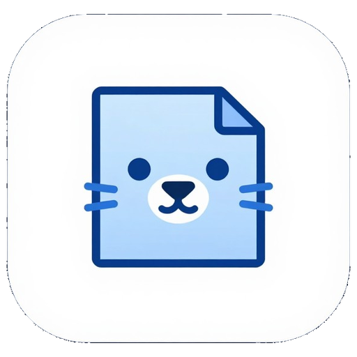
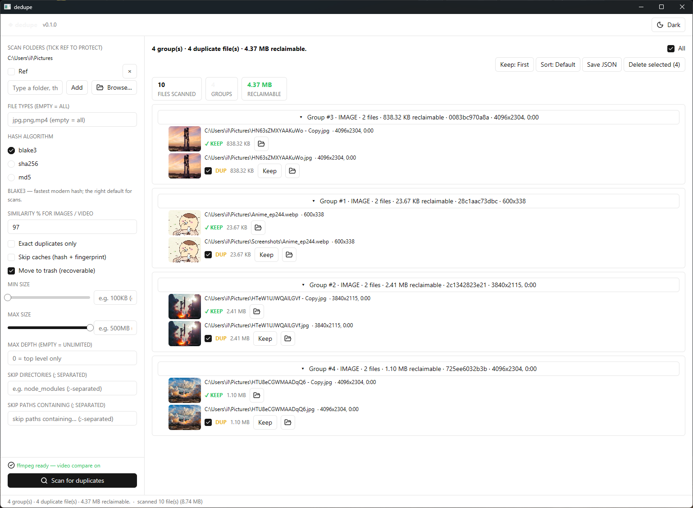
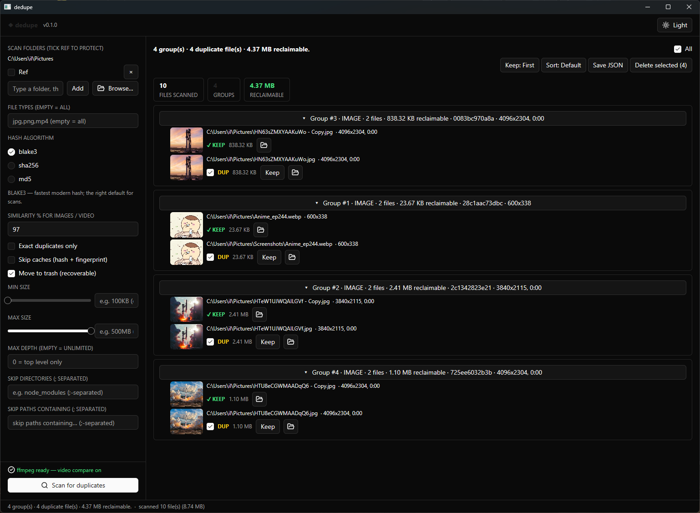
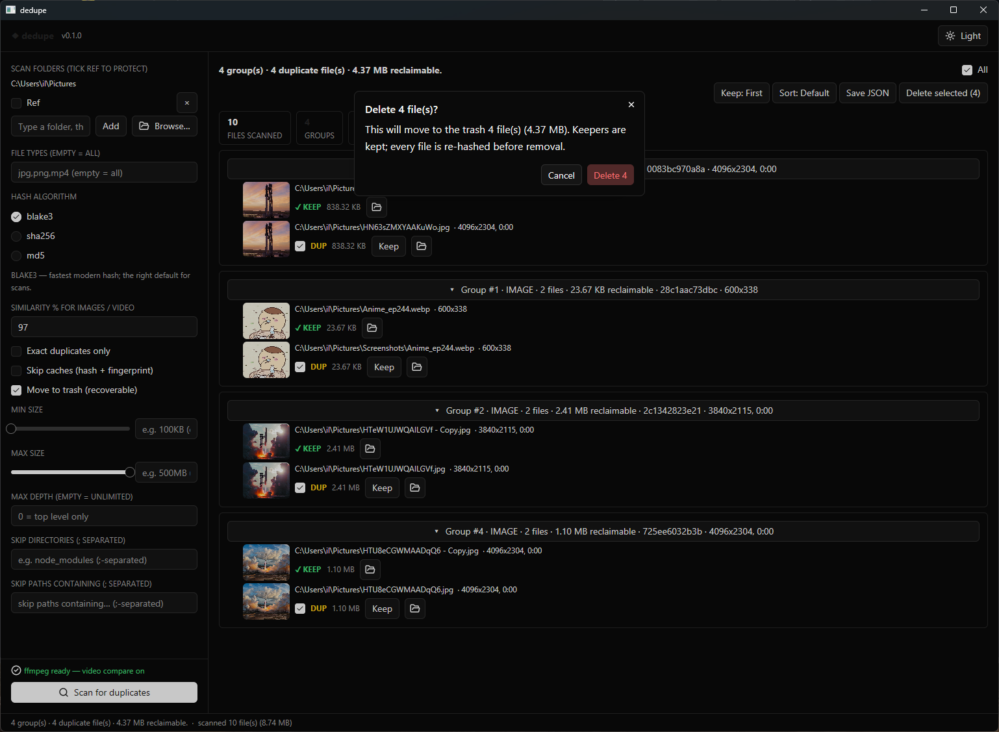

# dedupe



Finds duplicate files — exact copies and similar-looking photos/videos.

- **Exact duplicates** — same bytes. Copies, renames, backups.
- **Similar duplicates** (on by default) — same picture, different format (`.png` vs `.jpg`, `.mp4` vs `.mov`). Disable with `--exact`.

One binary, no install. Windows, macOS, Linux.

## Screenshots

| Light | Dark | Delete confirm |
| --- | --- | --- |
|  |  |  |

## Features

### Exact detection

- Size → partial-hash (32 KB head + 32 KB tail) → full-hash; only shared sizes/hashes proceed.
- Hash via `blake3` (default), `sha256`, or `md5`; files ≤ 64 KB hashed whole.
- Hard links count once; parallel hashing with `--jobs N` (`0` = auto, all-but-one core).

### Similar media (perceptual, on by default)

- Images: 256-bit dHash over a 17×16 thumbnail; re-encodes match at ≥ 97%.
- Videos: 8 frames via `ffmpeg` (fast pass ≤ 90 s, seeks above), symmetric sequence match ±2 frames.
- `--similarity PCT` tunes threshold (default `97`); `--exact` disables the pass.
- Bucketed by aspect ratio (images) / resolution + duration (videos), so unique files are never decoded; deterministic star clustering, no chained groups.

### Safe deletion

- Every file re-hashed before removal; changed files are skipped, never deleted.
- `--trash` recovers via system trash; `--dry-run` only lists (per-group subtotals included); prompts per group (`y/n/a/q`) unless `-y`.
- `--reference-dir PATH` (repeatable) never deleted and always keeps; keeper is first path by default, or `--keep-smaller` / `--keep-newest` / `--keep-oldest` / `--keep-best-quality` (highest resolution, then longest duration, then largest file).
- `--consolidate-dir DIR` gathers each group's keeper into one folder (flattened, collisions gain a ` (2)` suffix; reference keepers stay put). Every keeper is re-hashed before moving.

### Scope, reports, cache

- Scan files/dirs; filter with `--types`, `--min-size`/`--max-size`, `--max-depth`, `--exclude-dir`/`--exclude-path`.
- Human report (`✓ KEEP` / `✗ DUP` / `◈ REF`) or `--json`; `--verbose` adds codec metadata, `--quiet` silences progress.
- Caches in `~/.dedupe/` (`hashes.bin` ≥ 256 KB files, `fingerprints.bin`), keyed by size+mtime; `--no-cache` bypasses.
- Optional `ffprobe`/`ffmpeg` add resolution/duration/codec and video comparison; everything else works without them.

### GUI

```sh
dedupe-gui     # desktop app, no terminal
dedupe         # desktop app + terminal
dedupe --gui   # same, explicit
```

- Same pipeline as CLI; opens when no path given; pick folders, **Scan**, tick, **Delete selected** (trash by default, shows file count + bytes).
- **Consolidate** gathers every group's keeper into one folder (two clicks: pick folder, confirm).
- Per-folder **Ref** protection, **Keep** switch without rescanning (First / Smallest / Newest / Oldest / Best quality), thumbnails + cached video poster strips, JSON export, light/dark + prefs persisted.

> GUI builds need VS 2022 C++ workload on Windows ([details](https://gpui-kit.com/docs/installation)).

## CLI

```sh
dedupe <path>...                                   # scan
dedupe /media --delete                             # delete (prompts per group)
dedupe /incoming --reference-dir /backup -Dy --trash  # safe cleanup, no prompts
dedupe /photos --consolidate-dir /sorted -y          # gather one copy of everything
```

Flags: `--types` · `--keep-smaller`/`--keep-newest`/`--keep-oldest`/`--keep-best-quality` · `--reference-dir` · `--consolidate-dir` · `--trash` · `--dry-run` · `--exact` · `--similarity` · `--no-cache` · `--jobs` · `-y` · `--json` · `--verbose` · `--quiet`. Full list: `dedupe --help`.

## Build

```sh
.\build.ps1            # Windows: release -> dedupe.exe + dedupe-gui.exe
cargo build --release  # any OS
```

Needs Rust; optional FFmpeg for media metadata + video comparison (`dedupe.exe` = CLI+GUI, `dedupe-gui.exe` = GUI only, no console).

## How it works

Shared pipeline (`pipeline::run_scan`): Scanning → Hashing → Comparing media → Building report.

1. Walk paths, apply `--types`/size/depth/exclude filters; record unreadable paths without aborting.
2. Group by size; collapse hard links; partial-hash survivors, keep shared buckets.
3. Full-hash survivors (cache-assisted); identical hashes form exact groups, keeper picked, `ffprobe` metadata attached.
4. Similar pass on leftovers: bucket, fingerprint (dHash / 8 video frames), star-cluster at `--similarity`, per-member content hash stored.
5. Print human/JSON with reclaimable bytes; on `--delete`, prompt then re-hash and delete (trash/permanent).

Repeat scans skip unchanged files via size+mtime caches (`hashes.bin`, `fingerprints.bin`).

## Tests

```sh
cargo test
cargo clippy --all-targets
```

## Git hooks

Pre-commit checks run via [prek](https://prek.j178.dev/) (fast `pre-commit`
alternative): `cargo fmt`, `cargo clippy`, plus whitespace/file hygiene —
same checks as CI (`prek.toml`).

```sh
prek install            # run checks automatically on `git commit`
prek run --all-files    # run all checks on demand
```

## License

MIT
